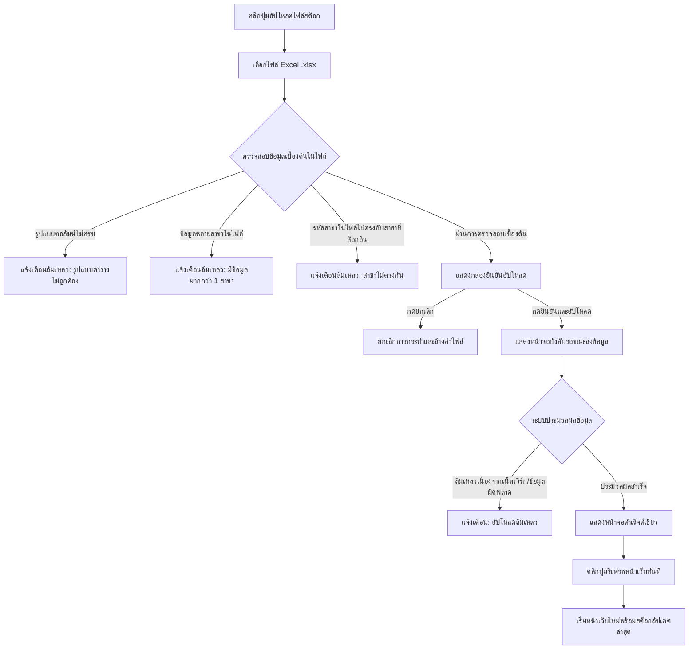

# คู่มือการใช้งานระบบ Shelf Check System (สำหรับผู้ใช้งานระดับสาขา)

ยินดีต้อนรับสู่คู่มือการใช้งาน **Shelf Check System** ฉบับละเอียด สำหรับผู้ใช้งานทั่วไปในระดับสาขา (Store User) เอกสารนี้รวบรวมฟังก์ชันการทำงาน วิธีการใช้งาน หน้าจอต่างๆ ขั้นตอนการทำรายการ และผลลัพธ์ที่เกิดขึ้นในแต่ละการกระทำ (Action) โดยละเอียด เพื่อให้ผู้ใช้สามารถจัดการและปฏิบัติงานหน้าร้านได้อย่างถูกต้องแม่นยำ

---

## สารบัญ
1. [การเข้าสู่ระบบ (Login)](#1-การเข้าสู่ระบบ-login)
2. [แถบนำทางหลัก (Main Navigation Bar)](#2-แถบนำทางหลัก-main-navigation-bar)
3. [การจัดการและอัปโหลดไฟล์สต็อก (Stock File Upload)](#3-การจัดการและอัปโหลดไฟล์สต็อก-stock-file-upload)
4. [การแจ้งเตือนอัปเดตแผนผังจากส่วนกลาง (POG Update Notifications)](#4-การแจ้งเตือนอัปเดตแผนผังจากส่วนกลาง-pog-update-notifications)
5. [หน้าแสดงข้อมูลชั้นวางสินค้า (Shelf View Mode)](#5-หน้าแสดงข้อมูลชั้นวางสินค้า-shelf-view-mode)
6. [แผงค้นหาและสแกนบาร์โค้ด (Barcode Scanner Panel)](#6-แผงค้นหาและสแกนบาร์โค้ด-barcode-scanner-panel)
7. [การส่งคำขอแก้ไขแผนผังชั้นวาง (POG Request Form)](#7-การส่งคำขอแก้ไขแผนผังชั้นวาง-pog-request-form)
8. [ประวัติคำขอเปลี่ยนแปลง (Request History)](#8-ประวัติคำขอเปลี่ยนแปลง-request-history)

---

## 1. การเข้าสู่ระบบ (Login)

หน้าแรกเมื่อเปิดโปรแกรมจะเป็นหน้าจอเข้าสู่ระบบซึ่งมี **2 โหมดหลัก** ให้เลือกใช้งานตามความสะดวก

| ส่วนแสดงผล / ปุ่ม | รูปแบบการกรอกข้อมูล / วิธีการใช้งาน | ผลลัพธ์ที่เกิดขึ้น (Action Outcomes) |
| :--- | :--- | :--- |
| **โหมดเลือกสาขา (Branch Mode)** | 1. คลิกที่แถบด้านล่างเพื่อเลือกหัวข้อ **"เลือกสาขา"**<br>2. คลิกที่กล่องเลือกสาขาเพื่อแสดงรายการสาขาที่เปิดใช้งาน<br>3. ค้นหาและคลิกเลือกสาขาของตนเอง<br>4. กดปุ่ม **"เข้าสู่ระบบ"** | • **กรณีสำเร็จ**: ระบบจะเข้าสู่ระบบให้อัตโนมัติ (รหัสผ่านของสาขาถูกประมวลผลอยู่เบื้องหลังเป็น `POG@รหัสสาขา`) และนำผู้ใช้ไปยังหน้าหลักของสาขาที่เลือกทันที<br>• **กรณีล้มเหลว**: แสดงข้อความสีแดงเตือนใต้กล่องเลือก เช่น *"ไม่พบผู้ใช้หรือยังไม่เปิดใช้งาน"* |
| **โหมดระบุรหัสผ่าน (Manual Mode)** | 1. คลิกที่แถบด้านล่างเพื่อเลือกหัวข้อ **"รหัสผ่าน"**<br>2. กรอก **"ชื่อผู้ใช้"** (User/Store code)<br>3. กรอก **"ใส่รหัสผู้ใช้"** (Password)<br>4. กดปุ่ม **"เข้าสู่ระบบ"** (หรือกดปุ่ม Enter บนแป้นพิมพ์) | • **กรณีสำเร็จ**: หากสิทธิ์เป็นผู้ใช้ทั่วไป จะถูกส่งไปที่หน้าหลักของสาขาที่เกี่ยวข้อง หากกรอกผิดจะขึ้นข้อความเตือน<br>• **กรณีล้มเหลว**: แสดงข้อความสีแดงเตือน เช่น *"ชื่อผู้ใช้หรือรหัสผ่านไม่ถูกต้อง"* หรือ *"ไม่พบผู้ใช้หรือยังไม่เปิดใช้งาน"* |

> [!TIP]
> หากเครื่องคอมพิวเตอร์หรือแท็บเล็ตของคุณเคยเข้าสู่ระบบค้างไว้และยังไม่หมดอายุหรือไม่ได้กดออกจากระบบ ระบบจะพาเข้าสู่หน้าหลักของสาขาปลายทางให้อัตโนมัติเมื่อเปิดหน้าเว็บ

---

## 2. แถบนำทางหลัก (Main Navigation Bar)

แถบสีเขียว (Emerald) ด้านบนสุดของหน้าเว็บ ทำหน้าที่แสดงสถานะของข้อมูล และเป็นจุดเชื่อมต่อไปยังฟังก์ชันจัดการสต็อก การแจ้งเตือน และข้อมูลบัญชีผู้ใช้

```
[Icon] Shelf Check System  •  [Stock: DD/MM/YYYY HH:MM]  [ปุ่มอัปโหลด]  ----  [ปุ่มแจ้งเตือน POG]  [รูปโปรไฟล์สาขา ▾]
```

### รายละเอียดองค์ประกอบบนแถบนำทาง
* **Stock Time Indicator (`Stock: DD/MM/YYYY HH:MM`)**: แสดงวันและเวลาล่าสุดที่มีการอัปเดตข้อมูลจำนวนสินค้าคงเหลือ (Stock) ในระบบของสาขาคุณ
* **ปุ่มอัปโหลด Stock (รูปก้อนเมฆและลูกศรชี้ขึ้น)**: ใช้สำหรับอัปโหลดข้อมูลสต็อกสาขาล่าสุดเข้าระบบ (แสดงเฉพาะผู้ใช้งานระดับสาขา)
* **ปุ่มแจ้งเตือน POG (รูปกระดิ่ง)**: ใช้รับทราบข้อมูลการปรับแผนผังที่ส่วนกลางส่งมาที่สาขา พร้อมแสดงตัวเลขสีแดงบอกจำนวนรายการค้างรับทราบ
* **ปุ่มโปรไฟล์สาขา (ตัวอักษรแรกของสาขา)**: แสดงรหัสสาขาและสถานะ เมื่อคลิกจะเปิดเมนูย่อย:
  * **ประวัติคำขอเปลี่ยนแปลง**: คลิกเพื่อดูสถานะคำขอที่เราเคยส่งไปส่วนกลาง
  * **ออกจากระบบ**: ล้างข้อมูลเซสชันความปลอดภัยทั้งหมดและนำทางกลับไปยังหน้าล็อกอิน

---

## 3. การจัดการและอัปโหลดไฟล์สต็อก (Stock File Upload)

การอัปเดตสต็อกสินค้าสาขาทำได้โดยการอัปโหลดไฟล์ Excel (`.xlsx`) ผ่านปุ่มรูปก้อนเมฆบนแถบนำทาง

> [!WARNING]
> **ข้อจำกัดระยะเวลา (Cooldown)**: สาขาสามารถอัปโหลดไฟล์สต็อกใหม่ได้ **ทุกๆ 60 นาที** เท่านั้น หากอยู่ในช่วงคูลดาวน์ ปุ่มอัปโหลดจะมีไอคอนสีเทา แสดงนาทีที่เหลือ (เช่น `59m`) และปฏิเสธการกดปุ่มอัปโหลด

### ขั้นตอนการดำเนินการและผลลัพธ์



### การตรวจสอบความถูกต้องเบื้องต้น (Pre-validation)
เมื่อผู้ใช้งานเลือกไฟล์ ระบบจะตรวจสอบข้อมูลภายในไฟล์ทันทีก่อนส่งขึ้นเซิร์ฟเวอร์ โดยไฟล์ Excel ต้องเป็นไปตามเงื่อนไขดังนี้:
1. **คอลัมน์หลัก**: ต้องมีหัวตารางที่สะกดตรงตัว ได้แก่ **"รหัสสินค้า"**, **"รหัสสาขา"**, และ **"จำนวนคงเหลือ"** เท่านั้น (หากหาไม่พบ ระบบจะแจ้งเตือนความผิดพลาดและยกเลิกกระบวนการทันที)
2. **ข้อมูลภายใน**: ต้องมีเฉพาะข้อมูลของ **สาขาตนเองเท่านั้น** และ **ห้ามมีข้อมูลปะปนหลายสาขา** (หากมีข้อมูลสาขาอื่นปนมา จะแสดงข้อความแจ้งเตือนและระบุรายชื่อสาขาแปลกปลอมนั้นทันที)

### สถานะหน้าจอและผลลัพธ์
* **ปุ่มอัปโหลดหมุนวน**: แสดงขณะกำลังอ่านและตรวจสอบเนื้อหาภายในไฟล์ Excel ในเครื่อง
* **กล่องยืนยันการอัปโหลด (Confirm Modal)**: แสดงข้อความยืนยันชื่อไฟล์และรหัสสาขาให้ตรวจความถูกต้องอีกครั้งก่อนส่งจริง
* **หน้าจอประมวลผลสีดำ (Fullscreen Blocking Overlay)**: แสดงเมื่อกดส่งไฟล์ ระบบจะล็อกหน้าจอไม่ให้ใช้งานหรือกดปุ่มอื่น เพื่อป้องกันข้อมูลซ้ำซ้อนหรือบกพร่อง ห้ามรีเฟรชหรือปิดบราวเซอร์เด็ดขาด
* **กล่องผลลัพธ์ความสำเร็จ (Success Modal)**: เมื่ออัปโหลดสต็อกเข้าฐานข้อมูลเรียบร้อย จะปรากฏเครื่องหมายถูกสีเขียวขนาดใหญ่ พร้อมปุ่มบังคับ **"รีเฟรชหน้าเว็บทันที"**
  * *ผลลัพธ์ของการกดปุ่มรีเฟรช*: หน้าเว็บจะโหลดซ้ำข้อมูลแผนผังและจำนวนสต็อกใหม่ทันทีเพื่อให้สอดคล้องกับไฟล์ที่เพิ่งนำเข้า

---

## 4. การแจ้งเตือนอัปเดตแผนผังจากส่วนกลาง (POG Update Notifications)

ปุ่มกระดิ่งบนแถบนำทางหลักจะแจ้งเตือนเมื่อฝ่ายจัดเรียงส่วนกลาง (HQ Admin) ได้อัปเดตแผนผังของสาขาคุณและต้องการให้คุณไปดำเนินการจัดหน้าร้านจริงให้สอดคล้องกัน

### ประเภทรายการแจ้งเตือนที่พบ
เมื่อคลิกที่ไอคอนกระดิ่ง รายการอัปเดตจะแบ่งออกเป็น 3 ประเภท พร้อมระบุพิกัดชัดเจน:

| ประเภทการเปลี่ยนแปลง | สีสัญลักษณ์ของสถานะ | ข้อมูลพิกัดที่ระบุและผลลัพธ์ที่ต้องดำเนินการ |
| :---: | :---: | :--- |
| **นำสินค้าเข้า (Add)** | <span style="color: #047857; background-color: #ecfdf5; border: 1px solid #a7f3d0; padding: 2px 6px; border-radius: 4px; font-weight: bold; text-shadow: none;">นำสินค้าเข้า</span> | • ระบุ Shelf, ชั้นที่ (Row), และลำดับจัดวาง (Index) ปลายทาง<br>• ผู้ใช้ต้องนำสินค้ารายการดังกล่าวไปจัดวางที่จุดที่กำหนดหน้าร้าน |
| **นำสินค้าออก (Delete)** | <span style="color: #be123c; background-color: #fff1f2; border: 1px solid #fecdd3; padding: 2px 6px; border-radius: 4px; font-weight: bold; text-shadow: none;">นำสินค้าออก</span> | • ระบุ Shelf, ชั้นที่, และตำแหน่งเดิมที่เคยอยู่<br>• ผู้ใช้ต้องเก็บสินค้าออกจากพิกัดที่แจ้งเพื่อนำไปเก็บหลังร้าน |
| **เปลี่ยนตำแหน่ง (Move)** | <span style="color: #1d4ed8; background-color: #eff6ff; border: 1px solid #bfdbfe; padding: 2px 6px; border-radius: 4px; font-weight: bold; text-shadow: none;">เปลี่ยนตำแหน่ง</span> | • ระบุพิกัดเดิม (จาก Shelf/ชั้น/ลำดับ) และ พิกัดใหม่ (ไป Shelf/ชั้น/ลำดับ)<br>• ผู้ใช้ต้องย้ายสินค้าจริงบนชั้นวางจากตำแหน่งเดิมไปยังตำแหน่งใหม่ |

### การกระทำของผู้ใช้งาน (Actions)
1. **กดปุ่มเครื่องหมายถูก (รับทราบรายรายการ)**: เมื่อจัดเรียงสินค้าหน้าร้านเสร็จแล้ว ให้คลิกปุ่มเครื่องหมายถูกที่ท้ายรายการนั้น
   * *ผลลัพธ์*: รายการนั้นจะหายไปจากกล่องแจ้งเตือนทันที และตัวเลขสีแดงบนไอคอนกระดิ่งจะลดลง 1
2. **กดปุ่ม "รับทราบทั้งหมด"**: คลิกปุ่มนี้ที่หัวมุมขวาบนของเมนูกระดิ่ง
   * *ผลลัพธ์*: บันทึกการรับทราบทุกรายการที่แสดงอยู่ทั้งหมดพร้อมกันในครั้งเดียว กล่องแจ้งเตือนจะปิดลง และตัวเลขกระดิ่งจะกลายเป็น 0

---

## 5. หน้าแสดงข้อมูลชั้นวางสินค้า (Shelf View Mode)

โหมดแสดงผลเริ่มต้นของระบบคือ **"ดูชั้นวาง"** ซึ่งให้มุมมองภาพรวมของสาขาทั้งหมด รวมไปถึงตารางระบุข้อมูลสินค้ารายชิ้น

### ส่วนประกอบและการตอบสนองในโหมดดูชั้นวาง

```
+-------------------------------------------------------------------------------------------------+
|                                 [แผนผังและตำแหน่งสาขาในร้าน]                                      |
|  [รูปจำลองผังทางกายภาพสาขา]    [ข้อมูลโครงสร้างสรุปชั้นวาง]        [แถบตัวกรองและช่องค้นหาสินค้า]      |
|  (คลิกเพื่อซูมดูรูปแผนผังเต็มจอ)  (คลิก Shelf เพื่อเลื่อนจอลงไปที่ข้อมูล)   (เลือกแสดงเฉพาะบาง Shelf ได้)  |
+-------------------------------------------------------------------------------------------------+
|  [การ์ดรายละเอียด Shelf (พับ/ขยายได้)] -> ตารางสินค้า (บาร์โค้ด, ราคา, ยอดสต็อกจริง, Min/Max)    |
+-------------------------------------------------------------------------------------------------+
```

#### A. ส่วนรูปภาพแผนจำลองสาขา (Branch Layout Map)
* แสดงรูปถ่ายแผนผังทางกายภาพของสาขานั้นๆ ที่ตั้งอยู่ในเครื่อง (เช่น `/images/branch/B01.png`)
* **ผลลัพธ์การกระทำ**: เมื่อคลิกที่รูปภาพ ระบบจะขยายเป็นภาพความละเอียดสูงเต็มหน้าจอทันที (Fullscreen Viewer) พร้อมทำให้พื้นหลังมืดลงเพื่อช่วยให้อ่านตำแหน่งชัดเจน การคลิกพื้นที่ว่างหรือกดกากบาทจะเป็นการย่อรูปกลับสภาพเดิม

#### B. แผงโครงสร้างสรุปชั้นสินค้า (Center Panel)
* สรุปรายการชั้นวางของสาขาทั้งหมดในรูปแบบปุ่มกด พร้อมแสดงจำนวนชั้นจัดเรียงของชั้นวางแต่ละอันและยอดรวมรายการ
* **ผลลัพธ์การกระทำ**: เมื่อคลิกเลือก Shelf ใดๆ ในแผงนี้ ระบบจะเลื่อนหน้าจอลงไปยังการ์ดรายละเอียดของ Shelf นั้นให้โดยอัตโนมัติ (Smooth Auto-scroll) พร้อมเปิดแถบข้อมูลรายละเอียดของชั้นวางนั้นและปิดกั้น Shelf อื่น เพื่อประหยัดเวลาการเลื่อนหาด้วยมือ

#### C. ตัวกรองชั้นวาง (Shelf Filters)
* แสดงปุ่มหมายเลขชั้นวางทั้งหมด (เช่น AA-1, AA-2) 
* **ผลลัพธ์การกระทำ**:
  * การกดปุ่มชั้นวางจะเป็นการเลือกฟิลเตอร์เฉพาะชั้นวางที่ต้องการดูเท่านั้น ชั้นวางอื่นๆ ที่ไม่ถูกเลือกจะถูกซ่อนชั่วคราว
  * เมื่อมีชั้นวางที่เลือกค้างไว้ จะปรากฏปุ่ม **"ล้างทั้งหมด"** ซึ่งเมื่อคลิกจะรีเซ็ตค่ากลับมาแสดงทุกชั้นวางตามเดิม

#### D. ตัวค้นหาสินค้าด่วนในหน้าเว็บ (Search Input)
* พิมพ์ชื่อแบรนด์ ยี่ห้อ หรือบาร์โค้ดสินค้าในกล่องค้นหานี้
* **การจำกัดการทำงาน (Validation Hint)**: หากกรอกข้อมูลเพียง 1 ตัวอักษร ระบบจะขึ้นตัวอักษรสีส้มเตือนว่า *"พิมพ์อย่างน้อย 2 ตัวอักษรเพื่อค้นหาให้แม่นยำขึ้น"*
* **ผลลัพธ์การกระทำ**:
  * ชั้นวางและการ์ดสินค้าที่ไม่มีแบรนด์หรือบาร์โค้ดที่ตรงกันจะถูกซ่อนไปจากหน้าจอโดยอัตโนมัติ
  * หากการ์ด Shelf นั้นถูกพับอยู่ ระบบจะคลี่แผงตารางสินค้าขยายออกอัตโนมัติ (`autoOpen`) เพื่อโชว์บรรทัดสินค้าที่ตรงกับคำค้นหาทันที
  * การกดปุ่ม **"X" (ล้างคำค้นหา)** ในกล่องจะล้างข้อความและดึงรายการสินค้าทุกชิ้นกลับมาแสดงผลทันที

#### E. การ์ดแสดงผลชั้นวาง (Shelf Card)
* ด้านบนของการ์ดระบุชื่อรหัสชั้นวาง จำนวนแถวชั้น และจำนวนสินค้าทั้งหมดที่วางอยู่
* **ผลลัพธ์การกระทำ**: เมื่อคลิกที่แถบหัวการ์ด จะย่อหรือขยายรายละเอียดตารางสินค้าสลับกันไป

#### F. ตารางรายการสินค้าในชั้นวาง (Shelf Product Table)
ตารางจะจัดแบ่งกลุ่มแถวตามตำแหน่งจริงหน้าร้าน (เช่น ชั้นที่ 1, ชั้นที่ 2 เรียงจากล่างขึ้นบน) ข้อมูลที่มีการแสดงผลและผลลัพธ์:
* **แถบสีเหลืองแจ้งเตือน (Duplicate Warning)**: หากสินค้ารายการใดมีบาร์โค้ดวางซ้ำซ้อนเกินกว่าหนึ่งพิกัดบนชั้นวาง บรรทัดสินคั้นจะแสดงเป็น **แถบสีเหลืองเข้ม** (`bg-yellow-200`) ทันทีเพื่อดึงดูดสายตา ให้พนักงานตรวจสอบว่ามีการจัดวางตำแหน่งวางผิดเป้าหมายหรือไม่
* **คอลัมน์ข้อมูลสินค้า**:
  * *ลำดับ (Index)*: ตำแหน่งแนวระนาบซ้ายไปขวา
  * *บาร์โค้ด & รหัส*: เลขรหัสระบุสินค้า
  * *สต็อก*: ข้อมูลสต็อกคงเหลือปัจจุบัน (ไฮไลต์อักษรหนาสีทอง)
  * *Min / Max / Pack / ราคา / อายุ (วัน)*: ข้อกำหนดคุณสมบัติสินค้าเพื่อให้ตรวจสอบและสั่งของได้ถูกต้อง

---

## 6. แผงค้นหาและสแกนบาร์โค้ด (Barcode Scanner Panel)

เมื่อสลับการทำงานมาที่โหมด **"สแกนบาร์โค้ด"** ผู้ใช้สามารถนำรหัสบาร์โค้ดสินค้าจริงมาสแกนหรือพิมพ์เพื่อค้นหาพิกัดและสร้างคำขอจัดวางได้ทันที

### การสแกนบาร์โค้ดด้วยกล้องถ่ายรูป (Camera Scan)
* ใช้งานผ่านปุ่มรูปกล้องถ่ายภาพ (แสดงผลในมุมมองหน้าจอมือถือ/แท็บเล็ต)
* **ผลลัพธ์การกระทำ**:
  * เปิดกล้องสแกนบาร์โค้ดบนหน้าต่างป๊อปอัป ให้ผู้ใช้นำบาร์โค้ดเข้ามากึ่งกลางกรอบแนวนอนสีขาว
  * เมื่อสแกนผ่านเรียบร้อย: ระบบจะดึงรหัสที่จับได้ไปวิเคราะห์อัตโนมัติ พร้อมส่งเสียง/สัญลักษณ์ตอบรับ จากนั้นปิดหน้าต่างกล้องลงทันทีและเริ่มกระบวนการค้นหาข้อมูล
  * **กรณีระบบไม่พบกล้อง**: หากสิทธิ์บราวเซอร์ถูกบล็อก จะแสดงแถบสีแดงเตือน *"ไม่ได้อนุญาตใช้กล้อง"* หรือ *"ไม่พบกล้องในอุปกรณ์"*

### การค้นหาด้วยการป้อนบาร์โค้ด (Keyboard Scan)
* คลิกในช่องกรอกพิมพ์ และกรอกรหัสบาร์โค้ด (หากกรอกต่ำกว่า 5 หลัก จะระบุตัวสีแดงเตือน *"บาร์โค้ดอย่างน้อย 5 ตัว"*) จากนั้นกดปุ่ม "ค้นหา" หรือ Enter

### ผลลัพธ์จากการค้นหารายการสต็อก (Lookup Results)
เมื่อค้นหาสินค้าระบบจะส่งข้อมูลไปคิวรีฐานข้อมูลและแสดงสถานะ 3 แบบดังนี้:

| สถานะข้อมูลสินค้า | รายละเอียดที่แสดงบนหน้าจอ | ผลการกระทำและปุ่มทางเลือก (Action Buttons) |
| :--- | :--- | :--- |
| **1. ไม่พบข้อมูลใดๆ** | ป๊อปอัปข้อความแดงแจ้งสถานะ เช่น *"ไม่พบข้อมูลสินค้า"* หรือ *"หมดเวลาเชื่อมต่อ"* | • มีเฉพาะปุ่ม **"ปิด"** ให้กดยกเลิกและเริ่มพิมพ์ค้นหารายการใหม่ |
| **2. พบสินค้าในระบบ<br>แต่ไม่มีตำแหน่งจัดวาง** | แสดงข้อมูลสินค้า เช่น ชื่อสินค้า, แบรนด์, และราคา แต่ด้านล่างขึ้นแถบสีส้มระบุ *"ยังไม่มีตำแหน่งบนชั้นวาง"* | • ปรากฏปุ่มสีเขียว **"แจ้งเพิ่มตำแหน่ง"** เพื่อเปิดแบบฟอร์มขอจัดวางสินค้าชิ้นนี้บนผังของสาขา |
| **3. พบสินค้าในระบบ<br>และมีตำแหน่งเดิมอยู่แล้ว** | แสดงข้อมูลสินค้าและราคา พร้อมมีกล่องสรุปข้อมูลสีเขียวบอกตำแหน่งพิกัดเดิม เช่น *Shelf AA-1 / ชั้น 2 / ลำดับ 3* | • ปรากฏปุ่มสีเหลืองเขียนว่า **"แจ้งเปลี่ยน"** เพื่อขอย้าย ย้ายสลับ หรือนำออกจากชั้นวางสินค้า |

---

## 7. การส่งคำขอแก้ไขแผนผังชั้นวาง (POG Request Form)

แบบฟอร์มขอเปลี่ยนแผนผัง (POG Request Modal) จะปรากฏขึ้นเมื่อผู้ใช้กดปุ่มทำรายการสินค้าผ่านโหมดการทำงานบาร์โค้ด เพื่อขอให้ส่วนกลางอัปเดตและบันทึกฐานข้อมูลจัดวางตำแหน่งใหม่

### ประเภทคำขอที่เลือกได้ (Action Options)
1. **เพิ่มสินค้า (Add)**: ส่งคำขอระบุให้วางสินค้านี้ลงบนพิกัดว่างพิกัดใหม่
   * *สิทธิ์ในการใช้งาน*: ปุ่มจะอนุญาตให้กดเลือกได้เฉพาะสินค้าที่สแกนแล้วระบุว่า "ยังไม่มีตำแหน่งในสาขา" เท่านั้น
2. **ย้ายตำแหน่ง (Move)**: ขอสลับพิกัดย้ายสินค้านี้จากตำแหน่งเดิมไปพิกัดอื่น
   * *สิทธิ์ในการใช้งาน*: จะกดเลือกประเภทนี้ได้ต่อเมื่อสินค้ามีพิกัดระบุตำแหน่งปัจจุบันเรียบร้อยแล้วเท่านั้น
3. **ลบสินค้า (Delete)**: ขอนำสินค้านี้ออกจากแผนผังจัดเรียงทั้งหมด
   * *สิทธิ์ในการใช้งาน*: ใช้เมื่อสินค้ายกเลิกขาย เลิกวางจำหน่าย หรือสินค้าหมดอายุถาวรหน้าร้าน (เมื่อกดเลือก ข้อมูลช่องกรอกเป้าหมายจะถูกซ่อนทันที)

```
[ประเภทเปลี่ยนแปลง:  เพิ่มสินค้า (Add)  |  ย้ายตำแหน่ง (Move)  |  ลบสินค้า (Delete) ]
                                 ▼
                     (กรณีเลือก Add หรือ Move)
[ เลือกชั้นวาง (Dropdown) ] -> [ เลือกชั้น (Row) ] -> [ เลือกลำดับพิกัด (Index) ]
                                 ▼
              [ ข้อมูลพิกัดสรุปสีเขียว / คำเตือนสีแดง ]
                                 ▼
                    [ หมายเหตุคำอธิบายเหตุผล ]
```

### การเลือกตำแหน่งปลายทางและผลลัพธ์ระบบตรวจจับความปลอดภัย
ในการระบุเป้าหมาย (กรณีขอเพิ่มหรือย้ายตำแหน่ง) ระบบจะทำงานอย่างสัมพันธ์กันและมีความปลอดภัยสูงดังนี้:
* **ชั้นวาง (Shelf)**: แสดงรายชื่อรหัสชั้นสินค้าที่มีอยู่ในสาขาทั้งหมด เมื่อเลือกแล้วจะไปปลดล็อกช่องตัวเลือก "ชั้น"
* **ชั้นที่ (Row)**: ดึงข้อมูลความสูงชั้นวางของชั้นนั้นมาแสดงผลเป็นตัวเลือกชั้น (เช่น 1 ถึง 5) เมื่อเลือกชั้นแล้วจะไปปลดล็อกช่องตัวเลือก "ลำดับ"
* **ลำดับ (Index)**: ดึงตำแหน่งสินค้าปัจจุบันที่มีอยู่ของชั้นนั้นมาทำตัวเลือก และจะบวกเพิ่มให้อีก 1 ตำแหน่งสำหรับกรณียกเว้นที่พนักงานต้องการขอเพิ่มเป็นตำแหน่งใหม่ต่อท้ายขวาสุด (ระบบจะมีคำอธิบายระบุหลังตัวเลขกำกับว่า `(ตำแหน่งใหม่)`)
* **ระบบป้องการเลือกซ้ำที่เดิม (Same Location Prevention)**:
  * หากพนักงานคลิกปุ่มเลือกพิกัดปลายทางตรงกับพิกัดปัจจุบันเป๊ะๆ ระบบจะปฏิเสธการดำเนินการทันที โดยจะแสดงข้อความสีแดงหนาว่า **"ตำแหน่งเดิม! กรุณาเลือกตำแหน่งอื่น"** และปิดปุ่มส่งคำขอเพื่อป้องกันข้อมูลขยะไหลเข้าระบบ
* **ระบบป้องกันการขอเพิ่มซ้ำ (Duplicate Add Prevention)**:
  * หากสินค้าถูกจัดวางอยู่ในสาขาอยู่แล้ว พนักงานจะไม่สามารถกดเลือกคำขอประเภท "เพิ่มสินค้า (Add)" ได้ หากพยายามดำเนินการต่อระบบจะบล็อกการบันทึกข้อมูลและขึ้นแจ้งเตือนเพื่อชี้พิกัดเดิมทันที
* **การจดจำตำแหน่งอัปโหลดล่าสุด (Last Position Memory)**:
  * เพื่อความรวดเร็วในการจัดสินค้าเป็นชุด ระบบจะทำการบันทึกพิกัดชั้นวาง/ชั้นล่าสุดลงในเครื่องพนักงานผ่านหน่วยความจำบราวเซอร์ (`LocalStorage`) เมื่อเปิดหน้าขอจัดตำแหน่งสินค้าชิ้นถัดไป ข้อมูลพิกัดปลายทางจะถูกป้อนเลือกให้เบื้องต้นทันที ช่วยลดจังหวะการกดคลิกเลือกตัวกรองซ้ำๆ
* **ระบบตรวจจับการไม่มีการเคลื่อนไหว (Idle Detector 5 นาที)**:
  * ในขณะที่พนักงานเปิดหน้าต่างแบบฟอร์มกรอกทิ้งไว้โดยไม่ขยับหน้าจอนานเกิน 5 นาที ระบบจะดึงฐานข้อมูลผังชั้นวางล่าสุดมาอัปเดตใหม่อัตโนมัติเบื้องหลัง เพื่อให้แน่ใจว่าพิกัดเป้าหมายไม่ได้ถูกจับจองโดยเครื่องคอมพิวเตอร์เครื่องอื่นไปก่อนหน้านี้

### การบันทึกและผลลัพธ์
เมื่อกรอกข้อมูลเรียบร้อย (รวมถึงการพิมพ์เหตุผลประกอบในช่อง **หมายเหตุ** ได้สูงสุด 50 ตัวอักษร) แล้วกด **"ส่งคำขอ"**:
* **กรณีสำเร็จ**: ข้อมูลจะถูกจัดเก็บเข้าสู่ฐานข้อมูลประวัติเพื่อรอผู้ดูแลระบบดำเนินการอนุมัติ และขึ้นหน้าต่างสีเขียวเขียนว่า **"ส่งคำขอสำเร็จ!"** พนักงานสามารถกดปุ่ม "ปิด" เพื่อทำงานรายการต่อไป

---

## 8. ประวัติคำขอเปลี่ยนแปลง (Request History)

หากต้องการตรวจสอบสถานะคำขอต่างๆ ที่เคยส่งไปส่วนกลาง หรือยกเลิกคำขอที่ดำเนินการผิดพลาด สามารถเปิดตรวจสอบได้ผ่านหน้าต่าง **"ประวัติคำขอเปลี่ยนแปลง"** ในเมนูผู้ใช้งาน

### ข้อมูลรายละเอียดที่แสดงในตาราง
รายการประวัติจะแสดงข้อมูลครบถ้วนพร้อมจัดแบ่งหมวดหมู่ดังนี้:
* **ประเภท Action**: แสดงแถบสีระบุประเภทคำขอเพื่อความชัดเจน:
  * `เพิ่ม` (สีเขียว): คำขอติดตั้งสินค้าตำแหน่งใหม่
  * `ย้าย` (สีน้ำเงิน): คำขอขยับพิกัดสินค้า
  * `ลบ` (สีแดง): คำขอคัดแยกสินค้าออกจากผัง
* **รายละเอียดสินค้า**: แสดงชื่อรายการและเลขบาร์โค้ด และหากเป็นคำขอที่มีการระบุหมายเหตุ จะแสดงแถบสีส้มกำกับใต้รายการบอกข้อความหมายเหตุนั้น
* **ตำแหน่ง (Location)**: แจ้งข้อมูลพิกัดต้นทางและปลายทาง (เช่น *จาก AA-1/2/3 → ไป AA-1/2/4*)
* **เวลาส่ง**: แสดงวันที่และเวลาไทยตรงตามเวลาจริงของเครื่อง
* **สถานะคำขอ (Status Badges)**: แบ่งออกเป็น 5 สถานะสีต่างกันดังนี้:

| ค่าสถานะคำขอ | สีของสัญลักษณ์สถานะ | ความหมายและผลลัพธ์ของการกระทำ (Action Outcomes) |
| :---: | :---: | :--- |
| **รอดำเนินการ (Pending)** | <span style="color: #d97706; background-color: #fffbeb; border: 1px solid #fef3c7; padding: 2px 6px; border-radius: 4px; font-weight: bold; text-shadow: none;">รอดำเนินการ</span> | • คำขอเพิ่งส่งเข้าระบบ รอเจ้าหน้าที่ส่วนกลางทำการตรวจสอบ<br>• **มีปุ่ม "ยกเลิก"** ปรากฏท้ายรายการให้คลิกเพื่อถอนคำขอได้ทันที |
| **อนุมัติ (Approved)** | <span style="color: #2563eb; background-color: #eff6ff; border: 1px solid #dbeafe; padding: 2px 6px; border-radius: 4px; font-weight: bold; text-shadow: none;">อนุมัติ</span> | • เจ้าหน้าที่จัดเรียงส่วนกลางอนุมัติคำขอแล้ว รอระบบปรับเปลี่ยนแผนผัง<br>• *ผลลัพธ์*: ปุ่มยกเลิกท้ายรายการจะถูกปิดตัวลงโดยถาวร |
| **ไม่อนุมัติ (Rejected)** | <span style="color: #e11d48; background-color: #fff1f2; border: 1px solid #ffe4e6; padding: 2px 6px; border-radius: 4px; font-weight: bold; text-shadow: none;">ไม่อนุมัติ</span> | • ส่วนกลางตรวจสอบและปฏิเสธคำขอนั้น เช่น พิกัดซ้ำ หรือจัดวางผิดรูปแบบ<br>• แผนผังหน้าร้านจะยังคงยึดค่าเดิมตามแผนผังหลัก |
| **เสร็จสิ้น (Completed)** | <span style="color: #059669; background-color: #ecfdf5; border: 1px solid #d1fae5; padding: 2px 6px; border-radius: 4px; font-weight: bold; text-shadow: none;">เสร็จสิ้น</span> | • แผนผังชั้นวางของร้านคุณได้รับการปรับปรุงอย่างเป็นทางการเรียบร้อยแล้ว<br>• *ผลลัพธ์*: ข้อมูลพิกัดใหม่จะไปแสดงบนตารางดูชั้นวางทันที |
| **ยกเลิก (Cancelled)** | <span style="color: #64748b; background-color: #f1f5f9; border: 1px solid #cbd5e1; padding: 2px 6px; border-radius: 4px; font-weight: bold; text-shadow: none;">ยกเลิก</span> | • คำขอนี้ถูกเพิกถอนโดยผู้ใช้ของสาขาเองขณะอยู่ในสถานะ "รอดำเนินการ"<br>• จะไม่มีผลผูกพันหรือส่งข้อมูลไปให้แอดมินดำเนินการอีกต่อไป |

### การถอนและยกเลิกคำขอย้อนหลัง (Cancel Action)
* **เงื่อนไข**: ปุ่ม **"ยกเลิก"** จะแสดงขึ้นเฉพาะคำขอที่อยู่ในสถานะ **"รอดำเนินการ"** เท่านั้น
* **ผลลัพธ์การกระทำ**: เมื่อคลิกปุ่มยกเลิก ระบบจะเปิดกล่องยืนยัน *"คุณต้องการยกเลิกคำขอนี้ใช่หรือไม่?"* 
  * หากพนักงานกดตกลง ระบบจะทำการสื่อสารไปปลดสถานะคำขอนั้นจากฐานข้อมูล และสัญลักษณ์ท้ายรายการจะถูกเปลี่ยนแปลงเป็นสีเทา **"ยกเลิก"** ปิดท้ายการทำรายการ

---
*ผู้จัดทำ: ฝ่ายพัฒนาระบบ Shelf Check System — Planogram Management System*
