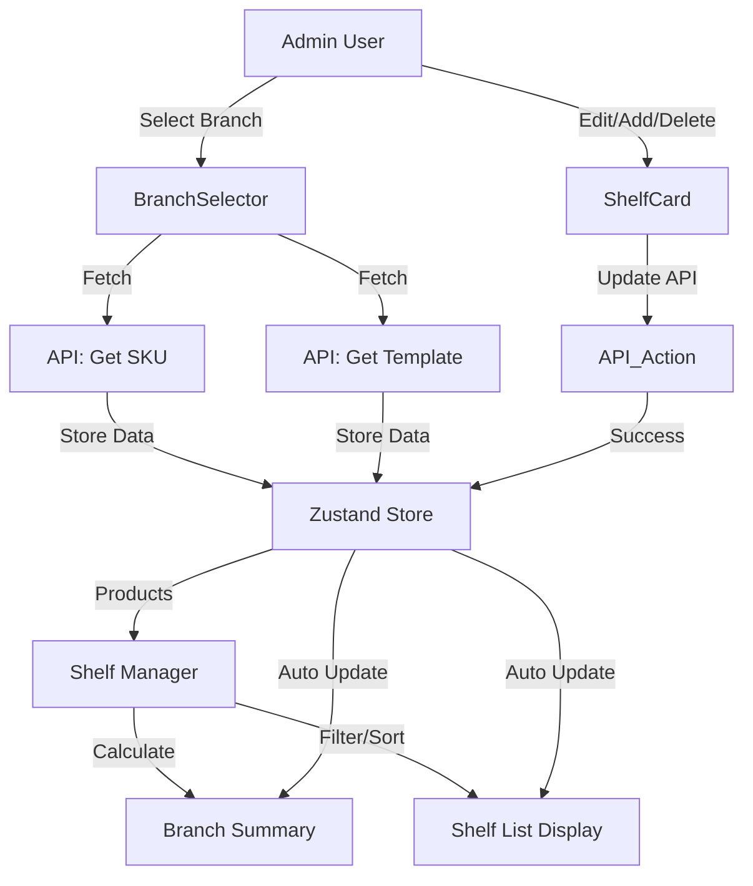

# 🏪 Shelf Manager System - คู่มือการใช้งานและรายละเอียดทางเทคนิค

## 🎯 ภาพรวม
**Shelf Manager** (`ShelfManager.jsx`) คือระบบจัดการ Planogram (POG) หลักสำหรับ Admin ใช้สำหรับดูภาพรวม, แก้ไขสินค้าบนชั้นวาง, ตรวจสอบยอดขาย, และจัดการสต็อกของแต่ละสาขา

ระบบถูกออกแบบมาให้รองรับข้อมูลปริมาณมาก และมีการ Optimize ประสิทธิภาพเพื่อลดการโหลดข้อมูลซ้ำซ้อน

---

## 🛠️ ฟีเจอร์หลัก (Features)

### 1. การเลือกสาขา (Branch Selection)
- แสดงรายการสาขาทั้งหมด
- เมื่อเลือกสาขาแล้วกด **"ตกลง"**:
  - ระบบจะล็อคการเลือกสาขา (`okLocked`)
  - โหลดข้อมูลสินค้า (SKU) ทั้งหมดของสาขานั้น
  - โหลด Template (โครงสร้างชั้นวาง) ของสาขานั้น

### 2. Dashboard & Summary 📊
ระบบคำนวณภาพรวมของทั้งสาขาอัตโนมัติเมื่อข้อมูลเปลี่ยน:
- **ยอดขาย (Total Sales):** คำนวณจากยอดขาย 90 วันย้อนหลัง
- **มูลค่าสต็อก (Total Stock Cost):** `Stock Qty` × `Purchase Price`
- **มูลค่าการเบิก (Total Withdraw):** มูลค่าสินค้าที่ถูกเบิกออก
- แสดงผลแยกราย Shelf และยอดรวมท้ายตาราง (TOTAL)

### 3. การค้นหาและกรอง (Search & Filter)
- **Search:** ค้นหาได้ด้วย **ชื่อแบรนด์** หรือ **บาร์โค้ด**
- **Filter:** เลือกแสดงเฉพาะ Shelf ที่ต้องการ (Multi-select)
- **Quick Jump:** เมื่อคลิกผลการค้นหา ระบบจะ Filter Shelf นั้นให้ทันที

### 4. การจัดการสินค้าเป็นราย Shelf (Shelf Card)
แสดงสินค้าในรูปแบบชั้นวาง (Grid/List) โดยแต่ละการ์ดสามารถ:
- **เพิ่มสินค้าใหม่:** ลงในตำแหน่งว่าง (Index ต่อไป)
- **แก้ไข:** จำนวน Face, Max Capacity, Min/Max Stock
- **ลบ:** ลบสินค้าออกจากตำแหน่ง (ระบบจะ Re-index สินค้าที่เหลือให้อัตโนมัติ)
- **สลับตำแหน่ง:** (ผ่านการแก้ไข Index หรือลบแล้วเพิ่มใหม่)

### 5. Export Data 📥
- รองรับการดาวน์โหลดข้อมูลเป็นไฟล์ **Excel (.xlsx)**
- จัดการ Format บาร์โค้ดให้เป็น Text เพื่อป้องกัน Excel ตัดเลข 0 นำหน้า

---

## ⚡ Performance Optimization

ระบบได้รับการปรับปรุงประสิทธิภาพเพื่อความรวดเร็วและลดภาระ Server (`shelf_store.jsx`)

### ✅ State Management (Local Update)
เมื่อมีการทำ Action สำเร็จ ระบบจะอัปเดตหน้าจอทันที **โดยไม่เรียก API เพื่อโหลดข้อมูลใหม่ทั้งสาขา**

| Action | การทำงานเบื้องหลัง |
|--------|-------------------|
| **เพิ่มสินค้า (Add)** | เรียก API Add → สำเร็จ → เพิ่มสินค้าลงใน `state.product` ทันที |
| **ลบสินค้า (Delete)** | เรียก API Delete → สำเร็จ → ลบออกจาก `state.product` และ **Re-index** สินค้าในแถวเดียวกันใหม่ทันที |
| **แก้ไข (Update)** | เรียก API Update → สำเร็จ → Merge ข้อมูลใหม่ทับของเดิมใน `state.product` |

> **ผลลัพธ์:** ทำให้การใช้งานลื่นไหล (Instant Feedback) และลดการใช้ Bandwidth

### ✅ Caching & Persistence
- ข้อมูลรายชื่อสาขา (`branches`) ถูกเก็บลง `localStorage` เพื่อลดการโหลดซ้ำตอนเข้าหน้าเว็บใหม่

---

## 🧬 Data Flow Diagram

---

## 🔒 ข้อจำกัดและเงื่อนไข (Constraints)

### 1. Data Logic
- **Sales 90 Days:** ยอดขายที่แสดงคำนวณจาก 90 วันย้อนหลัง (ตามเวลาประเทศไทย) โดยสิ้นสุดที่ "เมื่อวาน"
- **Unique Constraint:** ในหนึ่งสาขา + Shelf + Row + Index ควรมีสินค้าเพียงชิ้นเดียว
- **Images:** รูปภาพสินค้าและสาขาดึงจาก Path static (`/images/...`)

### 2. User Interface
- **Large Data:** หากสาขามีสินค้าจำนวนมาก (> 2,000 SKUs) อาจมีการหน่วงเล็กน้อยตอนคำนวณ Summary (ใช้ `useMemo` ช่วยบรรเทาแล้ว)
- **Print Mode:** หน้าจอมี `print:hidden` class สำหรับซ่อนปุ่มและเมนูที่ไม่จำเป็นเมื่อสั่งพิมพ์

---

## 🧪 การทดสอบ (Test Cases)

### กรณีทั่วไป
| # | Test Case | คาดการณ์ผลลัพธ์ |
|---|-----------|-----------------|
| 1 | เลือกสาขาแล้วกดตกลง | ปุ่มเลือกสาขาถูกล็อค, ข้อมูลโหลดขึ้นมาแสดง, Summary ถูกคำนวณ |
| 2 | ค้นพา "Coke" | แสดงรายการ shelf ที่มีสินค้าชื่อ/แบรนด์ Coke |
| 3 | คลิกผลการค้นหา | หน้าจอ Filter เหลือเฉพาะ Shelf ของสินค้านั้น |
| 4 | กด Clear Filter | แสดง Shelf ทั้งหมดเหมือนเดิม |

### การจัดการสินค้า
| # | Test Case | คาดการณ์ผลลัพธ์ |
|---|-----------|-----------------|
| 1 | **เพิ่มสินค้า** | สินค้าใหม่ปรากฏท้ายแถว, ยอด Summary เปลี่ยนทันที, ไม่มีการโหลดหมุนทั้งหน้า |
| 2 | **แก้ไขราคา/สต็อก** | ตัวเลขเปลี่ยน, ยอด Summary เปลี่ยนทันที |
| 3 | **ลบสินค้ากลางแถว** | สินค้าหายไป, สินค้าด้านขวาขยับมาแทนที่ (Index เปลี่ยน), Summary ลดลง |
| 4 | **ดาวน์โหลด Excel** | ได้ไฟล์ .xlsx ที่มีคอลัมน์ Barcode ถูกต้อง (ไม่เป็น Scientific notation) |

---

## 📁 โครงสร้างไฟล์ที่เกี่ยวข้อง

- **Main Component:** `src/features/admin/components/shelf/ShelfManager.jsx`
- **Store (Logic):** `src/store/shelf_store.jsx`
- **Sub-components:**
  - `BranchSelector.jsx` (เลือกสาขา)
  - `ShelfCard.jsx` (การ์ดแสดงชั้นวาง)
  - `ShelfFilter.jsx` (ตัวกรอง)
